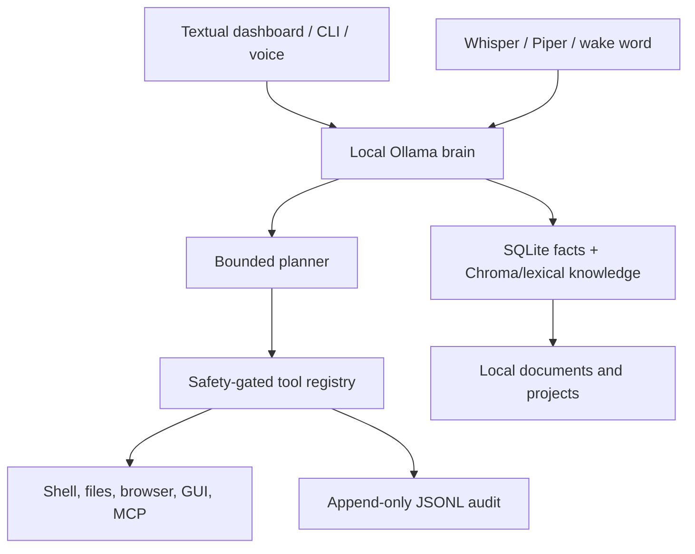

# PrakVerse architecture

```mermaid
flowchart TD
    UI[Textual dashboard / CLI / voice] --> Brain[Local Ollama brain]
    Brain --> Agent[Bounded planner]
    Agent --> Registry[Safety-gated tool registry]
    Registry --> Tools[Shell, files, browser, GUI, MCP]
    Registry --> Audit[Append-only JSONL audit]
    Brain --> Memory[SQLite facts + Chroma/lexical knowledge]
    Memory --> Sources[Local documents and projects]
    Voice[Whisper / Piper / wake word] --> Brain
```

The default path is local. Ollama, ChromaDB, browser, GUI, voice, and MCP are
replaceable adapters; no hosted API is needed by the core.
